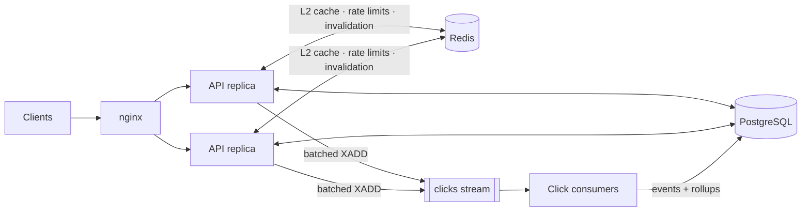

# Distributed URL Shortener


A URL shortener built with **FastAPI, PostgreSQL and Redis**, designed around a
read-heavy redirect path and operated like a production service.

- **Redirects at p99 < 100 ms under load:** 3,729 redirects/s at p99 73 ms on a
  single laptop ([PERFORMANCE.md](docs/PERFORMANCE.md)).
- **Three-tier cache:** in-process L1 for hot keys, Redis L2 with TTL jitter and
  negative caching, pub/sub invalidation across replicas, stampede protection
  and stale-if-error.
- **Click analytics** through Redis Streams and a batched consumer: at-least-once
  delivery, idempotent writes, hourly rollups, and hour/day time series.
- **JWT auth with RBAC:** refresh-token rotation with reuse detection (token
  families), argon2id passwords.
- **Distributed rate limiting:** Redis token buckets in an atomic Lua script.
- **Observability:** JSON logs with request ids, Prometheus metrics, liveness
  and readiness probes.
- **CI:** ruff, mypy `--strict`, 120 tests against real PostgreSQL and Redis,
  bandit, pip-audit, Trivy image scan.

## Architecture



Design decisions, alternatives considered and trade-offs are in
**[docs/ARCHITECTURE.md](docs/ARCHITECTURE.md)**. The profiling write-up, with
query plans and before/after numbers, is in
**[docs/PERFORMANCE.md](docs/PERFORMANCE.md)**.

## Quick start

```bash
make up                                     # nginx :8000 -> 2 API replicas, worker, postgres, redis
curl -s localhost:8000/health/ready

# register, log in, shorten, follow
curl -s -XPOST localhost:8000/api/v1/auth/register -H 'content-type: application/json' \
  -d '{"email":"me@example.com","password":"a-long-password"}'
TOKEN=$(curl -s -XPOST localhost:8000/api/v1/auth/login -H 'content-type: application/json' \
  -d '{"email":"me@example.com","password":"a-long-password"}' | jq -r .access_token)
curl -s -XPOST localhost:8000/api/v1/urls -H "authorization: Bearer $TOKEN" \
  -H 'content-type: application/json' -d '{"target_url":"https://example.com","custom_alias":"hello"}'
curl -si localhost:8000/hello | head -3      # 302 Found
curl -s localhost:8000/api/v1/urls/hello/analytics -H "authorization: Bearer $TOKEN"
```

Interactive API docs: <http://localhost:8000/docs>. Metrics: <http://localhost:8000/metrics>.

## API

| Method | Path | Auth | Description |
|---|---|---|---|
| `GET` | `/{code}` | – | 302 to the target (404 unknown/inactive, 410 expired) |
| `POST` | `/api/v1/auth/register` | – | Create an account |
| `POST` | `/api/v1/auth/login` | – | Access token (15 min) + refresh token |
| `POST` | `/api/v1/auth/refresh` | – | Rotate the refresh token; reuse revokes the family |
| `POST` | `/api/v1/auth/logout` | – | Revoke the refresh-token family |
| `GET` | `/api/v1/users/me` | user | Current profile |
| `POST` | `/api/v1/urls` | user | Shorten (`target_url`, optional `custom_alias`, `expires_at`) |
| `GET` | `/api/v1/urls?limit&cursor` | user | Own links, keyset-paginated |
| `GET` | `/api/v1/urls/{code}` | owner/admin | Link details |
| `PATCH` | `/api/v1/urls/{code}` | owner/admin | Change target, activate/deactivate, expiry |
| `DELETE` | `/api/v1/urls/{code}` | owner/admin | Soft delete (codes are never reused) |
| `GET` | `/api/v1/urls/{code}/analytics?granularity=hour\|day&start&end` | owner/admin | Time series, unique visitors, top referrers |
| `GET` | `/api/v1/admin/urls` | admin | All links |
| `PUT` | `/api/v1/admin/users/{id}/role` | admin | Change a role (revokes the user's sessions) |
| `GET` | `/health/live`, `/health/ready`, `/metrics` | – | Probes and Prometheus |

Errors share one shape: `{"error": {"code": "alias_taken", "message": "..."}}`.
Rate-limited responses are `429` with `Retry-After` and `X-RateLimit-*` headers.

## Development

```bash
uv sync                 # Python 3.12+, uv
make db                 # PostgreSQL + Redis only
make migrate
uv run uvicorn --factory app.main:create_app --reload
uv run python -m app.workers.click_consumer     # in another shell
make check              # ruff + mypy --strict + pytest (uses shortener_test / Redis db 15)
```

Configuration comes from environment variables prefixed `APP_`; see
[`.env.example`](.env.example). In production, `APP_JWT_SECRET` and
`APP_ANALYTICS_SALT` must be set or startup fails.

Operational commands:

```bash
uv run python -m app.cli create-admin admin@example.com
uv run python -m app.cli purge-refresh-tokens
uv run python -m app.cli purge-clicks --days 400
```

## Load testing

```bash
make up && make seed                  # 100k links, 5M clicks
make bench LABEL=my-run               # Locust inside the compose network
make explain                          # EXPLAIN ANALYZE of the hot-path queries
```

Methodology: [docs/BENCHMARKS.md](docs/BENCHMARKS.md).

## Project layout

```
app/
  api/           routes, dependencies, rate-limit dependencies
  cache/         L1 LRU, Redis L2, single-flight, pub/sub invalidation
  analytics/     click publisher (API side) and batch ingest SQL
  ratelimit/     token bucket (Lua) and policies
  services/      business logic (urls, links resolver, auth, analytics)
  repositories/  SQL for urls
  workers/       click-stream consumer
  observability/ metrics and ASGI middleware
migrations/      Alembic (hand-written, reversible, CONCURRENTLY where it matters)
tests/           120 tests against real PostgreSQL and Redis
loadtest/        Locust profile
scripts/         seed, bench, explain, summarize
docs/            architecture, performance, benchmarks, query plans
```
