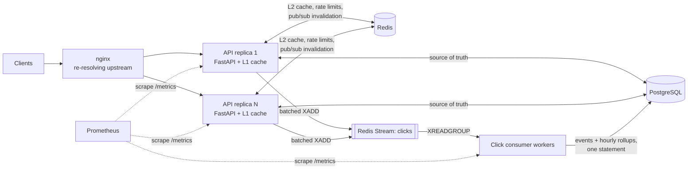
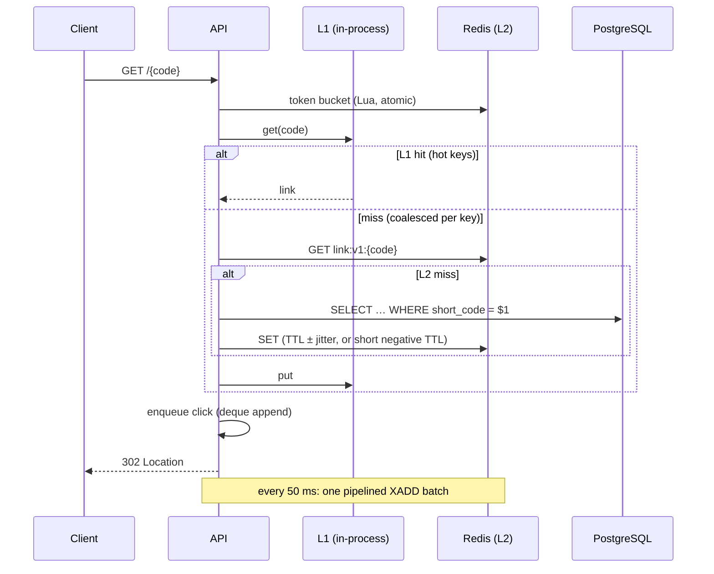

# Architecture and design decisions

## Components

## Redirect path

## Decisions and trade-offs

### Short codes: random base62 with conflict-safe insert
- **Chosen:** 7 random base62 characters from `secrets` (62⁷ ≈ 3.5×10¹²), inserted
  with `INSERT … ON CONFLICT (short_code) DO NOTHING RETURNING`. A `NULL` result
  means collision, so retry. The last attempt uses 8 characters, so a nearly
  full keyspace yields slightly longer codes instead of failed requests.
- **Rejected:** base62 of an auto-increment ID never collides, but it leaks
  creation volume and makes every link enumerable. A hash of the URL makes
  per-user links and aliases awkward. A pre-generated key pool (KGS) is an extra
  service to run, only worth it at far higher write volumes.
- **Why `ON CONFLICT` instead of catching `IntegrityError`:** a failed INSERT
  aborts the transaction, so every retry would need a SAVEPOINT.
  `ON CONFLICT` resolves the race inside PostgreSQL in one round trip.
- `short_code` uses `COLLATE "C"`: byte-wise, case-sensitive comparison, which is
  correct for base62 and cheaper than locale collation on every probe.

### Schema and indexes
| Table | Key indexes | Serves |
|---|---|---|
| `urls` | `UNIQUE(short_code)` | every redirect (cache miss) |
| | `(owner_id, id)` | "my links" keyset pagination (`WHERE id < cursor`) |
| `click_events` | `UNIQUE(event_id)` | idempotent ingestion |
| | `(url_id, occurred_at) INCLUDE (visitor_hash, referrer_host)` | index-only analytics |
| | BRIN `(occurred_at)` | retention deletes |
| `click_rollups_hourly` | PK `(url_id, bucket_start)` | time series |
| `refresh_tokens` | PK `token_hash`, `(family_id)`, `(user_id)` | rotation, family revocation |

- **Soft delete for links:** a deleted code is never reissued, so an old link
  printed somewhere can't be taken over by a new owner.
- **No FK from `click_events` to `urls`:** an FK check on every insert into the
  highest-volume table, and a cascade over millions of rows, costs more than
  it protects. Links are soft-deleted, so ids never dangle.
- **No `click_count` column on `urls`:** a counter on the link row makes every
  click an UPDATE of the same row for a viral link. Rollups take that role.

### Caching: three tiers
- **L1 (in-process LRU, 5 s TTL):** exists for hot keys. Without it, every request
  for a viral link lands on the single Redis shard that owns the key. With it,
  each process asks Redis at most once per TTL.
- **L2 (Redis, 1 h TTL ± 10% jitter):** jitter keeps entries cached together from
  expiring together.
- **Negative caching (30 s):** absorbs scans and typos. Creating a code
  explicitly invalidates its negative entry. Otherwise a code probed just before
  it was created would 404 for up to 30 s.
- **Invalidation:** writers *delete* (never set) after commit, then broadcast the
  code over pub/sub so every process evicts its L1. Pub/sub is at-most-once, so
  a subscriber flushes its whole L1 after every (re)connect, and the 5 s TTL
  bounds staleness regardless.
- **Stampede protection:** misses are coalesced per key (`SingleFlight`), so an
  expiring hot key causes one database query, not one per waiting request. The
  shared lookup runs in its own task, so a disconnecting client can't cancel it
  for the others.
- **Stale-if-error:** if Redis and PostgreSQL both fail, an L1 entry up to 5
  minutes past its TTL is served rather than an error.
- **Known race (accepted):** reader reads the old row → writer commits and
  deletes → reader writes the old value into Redis. The window is one database
  read. The mitigation, if needed, is a delayed second delete.

### Rate limiting: Redis token bucket in Lua
- Bursts up to `capacity`, then `refill_per_second` on average. A fixed window
  allows 2x the limit across a window boundary; a sliding log stores one
  entry per request.
- Atomic in one Lua script, and it uses Redis's `TIME`, so API hosts with skewed
  clocks can't mint tokens. Idle buckets expire once full.
- Policies: per IP for redirects and credential endpoints (brute force), per user
  for API reads/writes, with admins scaled ×10.
- **Fails open** if Redis is down: an outage degrades protection, not
  availability.

### Authentication
- Access tokens: HS256 JWT, 15 minutes. `alg`, `iss` and `type` are pinned, and
  authorization is checked from the claims without a database hit per request.
  Trade-off: a role change takes effect when the token expires, so role changes
  also revoke refresh tokens.
- Refresh tokens: opaque, 256-bit random. Only the SHA-256 digest is stored.
  They are rotated on every use. Presenting a used token revokes the whole
  family (theft detection). `SELECT … FOR UPDATE` makes concurrent refreshes
  have exactly one winner.
- Passwords: argon2id, hashed in a thread pool with at most 4 concurrent hashes
  (64 MiB each). A dummy verification for unknown emails keeps login timing
  identical.
- Links owned by someone else return 404, not 403, so ownership can't be probed.

### Click analytics pipeline
- Redirects never write to PostgreSQL. Events go to a Redis Stream. The
  `volatile-lru` eviction policy means the stream, which has no TTL, is never
  evicted.
- Consumers in a consumer group: at-least-once delivery, `XACK` after commit,
  and `XAUTOCLAIM` takes over entries from crashed consumers. The unique
  `event_id` makes redelivery a no-op. Malformed entries are acknowledged and
  dropped, so they can't block the stream.
- Events and rollups are written in one statement with `unnest` arrays: fixed SQL
  text regardless of batch size, one prepared statement, rollups computed only
  from newly inserted rows, and upserts ordered to avoid deadlocks between
  consumers.
- Visitor IPs are stored only as a keyed hash (HMAC).

### Operations
- `/health/live` checks nothing external, so a database outage never triggers a
  restart storm. `/health/ready` checks PostgreSQL and Redis, with 1 s timeouts.
- Metrics are labelled by *route template*, never the raw path (one series per
  short code would explode cardinality). Cache hit ratios per tier, rate-limit
  outcomes, collisions, DB pool usage, click-stream lag and batch latency are
  all exported.
- JSON logs through structlog carry the request id (propagated from
  `X-Request-ID` and validated against log injection). The middleware is plain
  ASGI, not `BaseHTTPMiddleware`, to avoid per-request task overhead.
- One process per container; scale by adding replicas. nginx re-resolves the
  service name every 5 s so replicas can be replaced or scaled without a reload.
